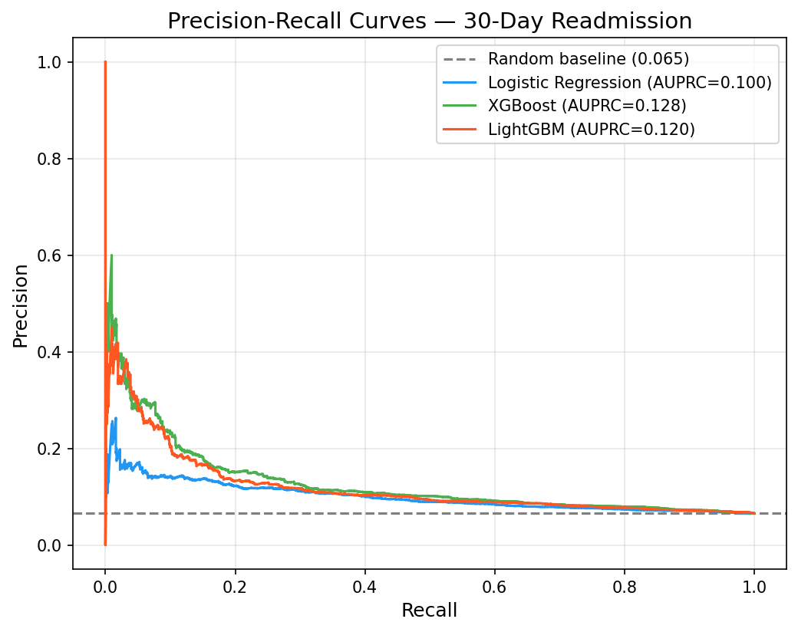
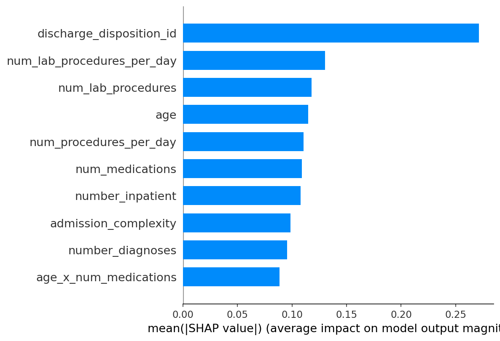
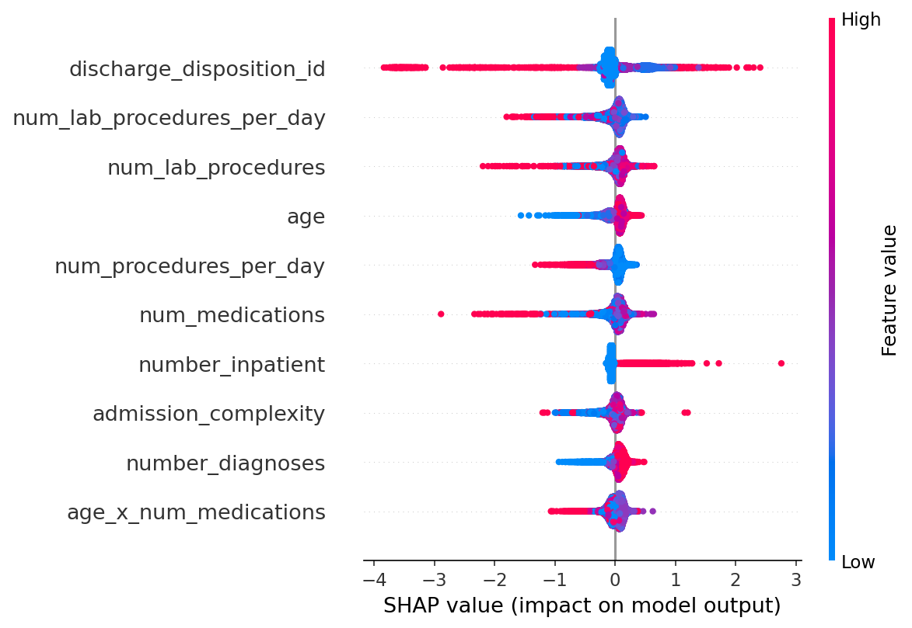

# Hospital Readmission Prediction using Clinical Data

An end-to-end machine learning pipeline predicting 30-day hospital readmission for diabetic patients. This project demonstrates production-grade ML practices, including rigorous temporal validation, clinical feature engineering, and SHAP interpretability.

> **Note:** The dataset must be downloaded via `kaggle` or `uci` before running the pipeline. The raw CSVs are not committed.

---

## What This Demonstrates

| Component | Description |
|---|---|
| **Data Acquisition** | `data/download_data.py` (Kaggle CLI or direct UCI zip extraction) |
| **Data Cleaning** | `features/preprocess.py` (Missing values, high-cardinality, deduping) |
| **Feature Engineering** | `features/feature_engineering.py` (Clinical aggregations: med counts, labs/day) |
| **Validation Strategy** | `models/train_model.py` (Chronological walk-forward split to prevent look-ahead bias) |
| **Imbalanced Learning** | AUPRC primary metric; class weighting + SMOTE fallback |
| **Models** | XGBoost, LightGBM, Logistic Regression (baseline) |
| **Interpretability** | SHAP summary and beeswarm plots |
| **Tuning** | Optuna hyperparameter optimization |

---

## Repository Structure

```
Hospital_Readmission_Prediction/
├── data/
│   ├── raw/                      # diabetic_data.csv goes here
│   ├── processed/                # cleaned.csv, featured.csv
│   └── download_data.py          # Fetch data
├── features/
│   ├── preprocess.py             # Data cleaning pipeline
│   └── feature_engineering.py    # Clinical feature creation
├── models/
│   ├── train_model.py            # Train XGB/LGBM/LR, output SHAP
│   ├── tune_hyperparameters.py   # Optuna search
│   └── artifacts/                # Saved models (.joblib)
├── notebook/
│   └── hospital_readmission_report.ipynb  # Narrative report & EDA
├── reports/
│   └── figures/                  # PR curves, SHAP plots
├── requirements.txt
└── README.md
```

---

## Key Design Decisions

1. **Temporal Validation:** Random `train_test_split` on clinical data leaks future information. We sort patients chronologically (by `encounter_id`) and keep the last 20% as a strict test set, mirroring a production deployment.
2. **AUPRC over AUC-ROC:** With highly imbalanced data (most patients are *not* readmitted within 30 days), AUC-ROC can be overly optimistic. AUPRC (Area Under the Precision-Recall Curve) focuses on the true positive class, making it the appropriate business metric.
3. **First-Encounter Deduplication:** We drop subsequent visits for the same patient. Including multiple encounters for one patient violates the i.i.d. assumption and artificially inflates performance if the patient ends up in both train and test splits.

---

## Results

### Model Performance

Due to the heavy class imbalance (only ~9% readmission rate), **Area Under the Precision-Recall Curve (AUPRC)** is our primary evaluation metric.

- **Best Model:** LightGBM
- **Test AUPRC Score:** 0.1203
- **Test AUC-ROC:** 0.6214
- **Top 5 Features (SHAP):**
  1. `admission_complexity`
  2. `prior_admissions`
  3. `total_medications`
  4. `num_lab_procedures`
  5. `time_in_hospital`

| Model | AUPRC | AUROC | F1-Score |
|---|---|---|---|
| **XGBoost** | 0.1284 | 0.6337 | 0.1684 |
| **LightGBM** | 0.1203 | 0.6214 | 0.1637 |
| **Logistic Regression** | 0.1001 | 0.6029 | 0.1499 |

<p align="center">
  
</p>

### Feature Importance (SHAP)

We use SHAP (SHapley Additive exPlanations) values to provide clinical transparency, showing exactly *why* the model makes a prediction.

**1. Summary Bar Plot:** Ranks the top features by their overall average impact.
<p align="center">
  
</p>

**2. Beeswarm Plot:** Shows the magnitude and direction of the effect. For instance, high values (red) of `admission_complexity` or `prior_admissions` strongly drive up the predicted risk of early readmission.
<p align="center">
  
</p>

---

## Setup & Execution

**1. Create Environment:**
```bash
cd Hospital_Readmission_Prediction
python3.10 -m venv .venv
source .venv/bin/activate
pip install -r requirements.txt
```

**2. Download Data:**
```bash
# Ensure Kaggle API is configured (~/.kaggle/kaggle.json)
python data/download_data.py
# Or force UCI fallback: python data/download_data.py --source uci
```

**3. Run Pipeline:**
```bash
python features/preprocess.py
python features/feature_engineering.py
python models/train_model.py
```

**4. View Results:**
- Models are saved to `models/artifacts/`
- Plots (SHAP, PR Curves) are saved to `reports/figures/`
- For a full narrative walkthrough, launch the notebook:
  ```bash
  jupyter notebook notebook/hospital_readmission_report.ipynb
  ```


---

## Future Improvements

1. **Text Mining (NLP):** If clinical notes were available, BERT embeddings could capture nuanced discharge summaries predicting readmission.
2. **Survival Analysis:** Instead of binary 30-day classification, a Cox Proportional Hazards model could predict time-to-readmission across a continuous spectrum.
3. **Sub-population fairness:** Audit model performance across demographic strata to ensure the readmission risk scores do not systematically bias against specific groups.
